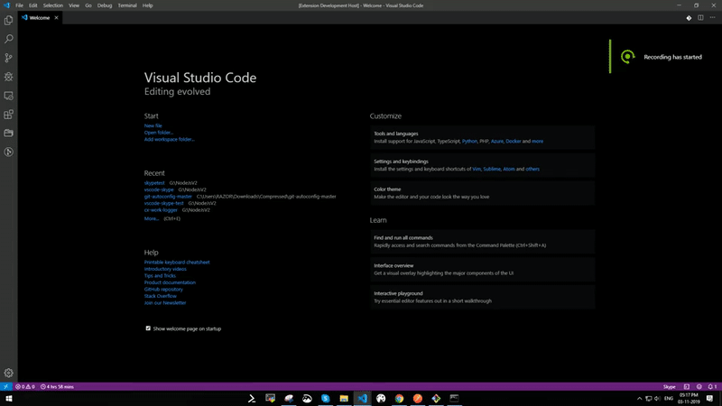
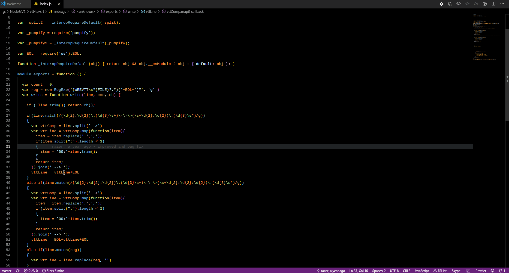

# vscode-skype

In work most of the developers use skack/skype for communication although slack has cool integration for vscode, skype lacks in it, 
with this extension you can now send messages to skype without leaving vscode.

## Features

* Send skype messages from within vscode :)
* send Message: `alt+s` or `cmd+alt+s`
* contacts list view : `alt+l` or `cmd+alt+l`
* send selected code : `alt+c` or `cmd+alt+c`

## Release Notes
### 0.0.4 2019-11-05 - added option to send code directly to skype
### 0.0.3 2019-11-03

Initial release of vscode-skype
